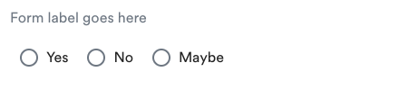
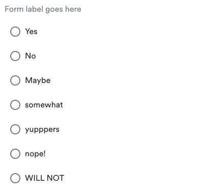
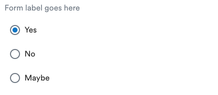
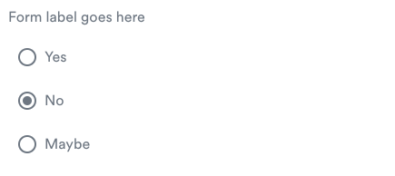
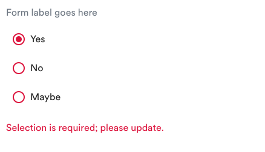
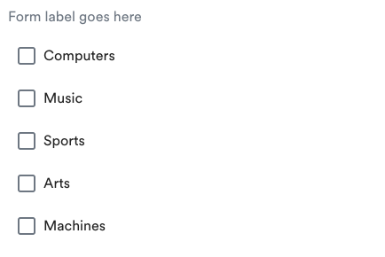
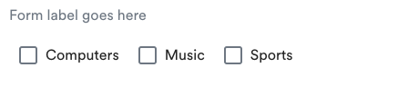
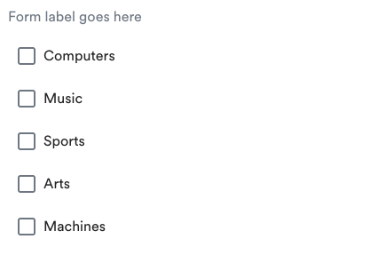
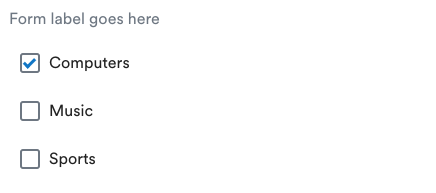
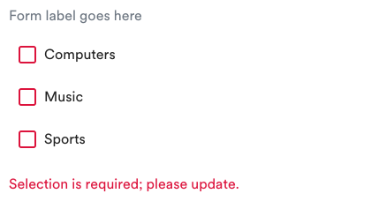

[](https://travis-ci.org/AlaskaAirlines/OrionStatelessComponents__ods-inputoptions)


# \<ods-inputoptions>

\<ods-inputoptions> is a wrapper component for a HTML \<input type"checkbox"> or \<input type"radio"> elements containing styling and behavior.

## Docs

All information regarding Project Setup, Technical Details, Tests and information regarding ODS Stateless Components can be found in the [./docs](https://github.com/AlaskaAirlines/OrionStatelessComponents__docs/tree/master/docs) repository.

## Install

```shell
$ npm i @alaskaairux/ods-inputoptions
```

### Design Token CSS Custom Property dependency

The use of any ODS Component has a dependency on the [ODS Design Tokens (npm install)](https://www.npmjs.com/package/@alaskaairux/orion-design-tokens). See repository and API information [here](https://github.com/AlaskaAirlines/OrionDesignTokens#orion-design-tokens).

For additional details in regards to using Orion Design Tokens with components, please see [./docs/TECH_DETAILS.md](https://github.com/AlaskaAirlines/OrionStatelessComponents__docs/blob/master/docs/TECH_DETAILS.md#building-resources-from-orion-design-tokens)

### CSS Custom Property fallbacks

CSS Custom Properties are not supported in older browsers. For this, fallback properties are pre-generated and included with the npm. Any update to the Orion Design Tokens will be immediately reflected with browsers that support CSS Custom Properties, legacy browsers will require updated components with pre-generated fallback properties.

### Define dependency in project component

Define the component dependency within each component that is using the \<ods-inputoptions> component.

```javascript
import "@alaskaairux/ods-inputoptions/dist/ods-inputoptions";
```

**Reference component in HTML**

```html
<ods-inputoptions></ods-inputoptions>
```

See additional examples below.

## Element \<ods-inputoptions>

```javascript
class Odsinputoptions extends LitElement
```

### Styling (experimental)

Option(s) for component customization not supported

| Selector | Type | State | Description |
|----|----|----|---|
| ::part() | pseudo-element | experimental | Update shadowDOM CSS from outside the component |

### inputoptions use cases

The \<ods-inputoptions> element should be used in situations where users may:

* Want an element that can be turned on and off.
* Have a collections of radio buttons describing a set of related options
* Require users to check an options

### Properties:

| Attribute | Value type | Description |
|----|----|----|
| disabled | boolean | enables disabled state of the element |
| horizontal | boolean | toggles layout direction, default is `vertical`, max 3 options |
| error | string | set error message for button/checkbox group |
| for | string | sets the `for` attribute for button/checkbox group label |
| label | string | sets content for button/checkbox group label |
| name | string | Accepts any string, `DOMString` representing the value of the input |
| type | string | Accepts `radio` or `checkbox` to assume functional type |
| componentData | object | Required to pass in `id`, `value` and `label` strings for each input |

## Type data return

Checking options for either radio buttons or checkboxes, the value of that selection is bubbled up to the parent component itself.

| Type | data type | Object name |
|---|---|---|
| radio | array | value |
| checkbox | array | value |

### Example: get value from radio button group

```js
const rdos = document.getElementById('rdo');
alert(rdos.value);
```

```html
<ods-inputoptions id="rdo" type="radio" name="rdo" label="Even Asher can do this!" for="radio1" componentData='[
  { "id": "radio1", "value": "yes", "label": "Yes" },
  { "id": "radio2", "value": "no", "label": "No" },
  { "id": "radio3", "value": "maybe", "label": "Maybe" }
]'></ods-inputoptions>
```

### Example: get value from checkbox group

```js
const cbxs = document.getElementById('cbx');
alert(cbxs.value);
```

```html
<ods-inputoptions id="cbx" type="checkbox" name="cbx" label="Form label goes here" for="cbx1" componentData='[
  { "id": "cbx1", "value": "yes", "label": "Yes" },
  { "id": "cbx2", "value": "no", "label": "No" },
  { "id": "cbx3", "value": "maybe", "label": "Maybe" }
]'></ods-inputoptions>
```

For more complete [examples using React](./docs/reactSupport.md).

## API Code Examples

### Default radio button group

`name` attribute is required to associate radio button group.

`componentData` object addresses `id`, `value` and `label` for each radio button in the group.


```html
<ods-inputoptions type="radio" name="radios" label="Form label goes here" for="radio1"
  componentData='[
    { "id": "radio1", "value": "yes", "label": "Yes" },
    { "id": "radio2", "value": "no", "label": "No" },
    { "id": "radio3", "value": "maybe", "label": "Maybe" }
  ]'></ods-inputoptions>
```

### Radio button group, `horizontal` option (limit 3 min breakpoint-narrow)



```html
<ods-inputoptions type="radio" horizontal name="radios" label="Form label goes here" for="radio1"
  componentData='[
    { "id": "radio1", "value": "yes", "label": "Yes" },
    { "id": "radio2", "value": "no", "label": "No" },
    { "id": "radio3", "value": "maybe", "label": "Maybe" }
  ]'></ods-inputoptions>
```

### Radio button group, `horizontal` option ignored due to option limit



```html
<ods-inputoptions type="radio" horizontal name="radios" label="Form label goes here" for="radio1"
  componentData='[
    { "id": "radio1", "value": "yes", "label": "Yes" },
    { "id": "radio2", "value": "no", "label": "No" },
    { "id": "radio3", "value": "maybe", "label": "Maybe" },
    { "id": "radio4", "value": "somewhat", "label": "somewhat" },
    { "id": "radio6", "value": "yupppers", "label": "yupppers" },
    { "id": "radio7", "value": "nope!", "label": "nope!" },
    { "id": "radio8", "value": "WILL NOT", "label": "WILL NOT" }
  ]'></ods-inputoptions>
```

### Radio button group with option set to `checked`



```html
<ods-inputoptions type="radio" name="radios" label="Form label goes here" for="radio1"
  componentData='[
    { "id": "radio1", "value": "yes", "label": "Yes", "checked": true },
    { "id": "radio2", "value": "no", "label": "No" },
    { "id": "radio3", "value": "maybe", "label": "Maybe" }
  ]'></ods-inputoptions>
```

### Radio button group set `disabled`



```html
<ods-inputoptions type="radio" name="radios" disabled label="Form label goes here" for="radio1"
  componentData='[
    { "id": "radio1", "value": "yes", "label": "Yes" },
    { "id": "radio2", "value": "no", "label": "No", "checked": true },
    { "id": "radio3", "value": "maybe", "label": "Maybe" }
  ]'></ods-inputoptions>
```

### Radio button group with error



```html
<ods-inputoptions type="radio" name="radios" for="radio1" label="Form label goes here" error="Selection is required; please update."
  componentData='[
    { "id": "radio1", "value": "yes", "label": "Yes", "checked": true },
    { "id": "radio2", "value": "no", "label": "No"},
    { "id": "radio3", "value": "maybe", "label": "Maybe" }
  ]'></ods-inputoptions>
```

### Default checkbox group



`name` attribute is needed to associate checkbox group.

`componentData` object addresses `id`, `value` and `label` for each checkbox in the group.

```html
<ods-inputoptions type="checkbox" name="interests" for="coding" label="Form label goes here"
  componentData='[
    { "id": "computers", "value": "computers", "label": "Computers" },
    { "id": "mucic", "value": "music", "label": "Music" },
    { "id": "sports", "value": "sports", "label": "Sports" },
    { "id": "arts", "value": "arts", "label": "Arts" },
    { "id": "machines", "value": "machines", "label": "Machines" }
  ]'></ods-inputoptions>
```

### Checkbox group, `horizontal` option (limit 3 min breakpoint-narrow)



```html
<ods-inputoptions type="checkbox" horizontal name="interests" label="Form label goes here" for="computers"
  componentData='[
    { "id": "computers", "value": "computers", "label": "Computers" },
    { "id": "mucic", "value": "music", "label": "Music" },
    { "id": "sports", "value": "sports", "label": "Sports" }
  ]'></ods-inputoptions>
```

### Checkbox group, `horizontal` option ignored due to option limit



```html
<ods-inputoptions type="checkbox" horizontal name="interests" label="Form label goes here" for="computers"
  componentData='[
    { "id": "computers", "value": "computers", "label": "Computers" },
    { "id": "mucic", "value": "music", "label": "Music" },
    { "id": "sports", "value": "sports", "label": "Sports" },
    { "id": "arts", "value": "arts", "label": "Arts" },
    { "id": "machines", "value": "machines", "label": "Machines" }
  ]'></ods-inputoptions>
```

### Checkbox group with option set to `checked`



```html
<ods-inputoptions type="checkbox" name="interests" for="computers" label="Form label goes here"
  componentData='[
    { "id": "computers", "value": "computers", "label": "Computers", "checked": true },
    { "id": "mucic", "value": "music", "label": "Music" },
    { "id": "sports", "value": "sports", "label": "Sports" }
  ]'></ods-inputoptions>
```

### Checkbox group set `disabled`


```html
<ods-inputoptions type="checkbox" name="interests" disabled for="computers" label="Form label goes here"
  componentData='[
    { "id": "computers", "value": "computers", "label": "Computers", "checked": true },
    { "id": "mucic", "value": "music", "label": "Music" },
    { "id": "sports", "value": "sports", "label": "Sports" }
  ]'></ods-inputoptions>
```

### Checkbox group with error



```html
<ods-inputoptions type="checkbox" name="interests" for="computers" label="Form label goes here" error="Selection is required; please update."
  componentData='[
    { "id": "computers", "value": "computers", "label": "Computers"},
    { "id": "mucic", "value": "music", "label": "Music" },
    { "id": "sports", "value": "sports", "label": "Sports" }
  ]'></ods-inputoptions>
```

## React support

No special environment support needed at this time.

## Alternate build solutions

Included with the distributed npm are two additional directories, `./altImportsCanonical` and `./altImportsVariable`.

| directory | description |
|---|---|
| altImportsCanonical† | Sass using canonical values within the scope of the file |
| altImportsVariable* | Sass using CSS Custom Properties within the scope of the file |

† Using canonical CSS properties breaks inheritance chain from Orion Design Tokens

\* Orion Design Tokens are required to import any file using CSS Custom Properties. Also see Orion Design Tokens [pre-processed resources](https://github.com/AlaskaAirlines/OrionDesignTokens#install-pre-processed-resources). PostCSS using `postcss-custom-properties` will need to be added to your project if you are supporting legacy browsers.

Within the respective directories is the `style_clean.scss` file.

```bash
├── altImports
|  ├── canonical
|  |  ├── style.css
|  |  └── style_clean.scss
|  └── variable
|     ├── style.css
|     └── style_clean.scss
```

It is highly recommended that you import the `style_clean.scss` this into a name-space as not to create style collisions. For example:

```scss
.ods-inputoptions {
  @import "./node_modules/@alaskaairux/ods-inputoptions/altImports/variable/style_clean.scss";
}
```

This pattern will produce all the selectors within `style_clean.scss` with the prefixed selector.

```scss
.ods-inputoptions .inputoptions {
  display: var(--ods-inputoptions-display);
  font-family: var(--ods-inputoptions-font-family);
  border-width: var(--ods-inputoptions-border-width);
  border-radius: var(--ods-inputoptions-border-radius);
  ...
}
```

**Warning!** Using the canonical CSS will break the chain of using Design Tokens. If Tokens are updated, this will require the update of the components and their canonical output. Use with caution.

##

Alaska Airlines Orion Design System<br>
Copyright 2019 Alaska Airlines, Inc. or its affiliates. All Rights Reserved.
